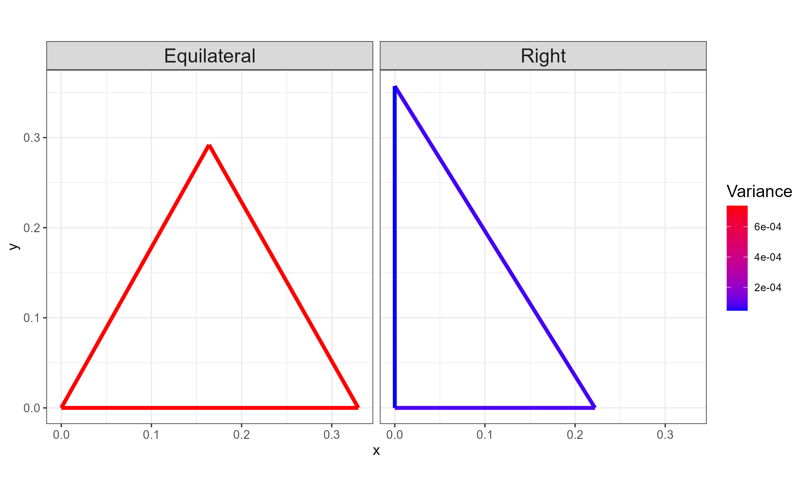

# BACON: Bayesian Clustering of *n*-gons

## Overview


## Cluster-Specific Mean *n*-gon

```r
v <- function(a, l, r) {
  n <- length(a)
  
  V <- matrix(0, 2, n + 1)
  V[1, 2] <- l[1]
  theta <- rep(0, n + 1)
  if (r == 1) {
    for (j in 1:(n - 1)) {
      index <- j + 1
      theta[index] <- theta[index - 1] + (pi - a[index])
      V[, index + 1] <- c(l[index]*cos(theta[index]), l[index]*sin(theta[index])) + V[, index]
    } 
  }
  if (r == 0) {
    for (j in 1:(n - 1)) {
      index <- j + 1
      theta[index] <- theta[index - 1] - (pi - a[index])
      V[, index + 1] <- c(l[index]*cos(theta[index]), l[index]*sin(theta[index])) + V[, index]
    }
  }
```


