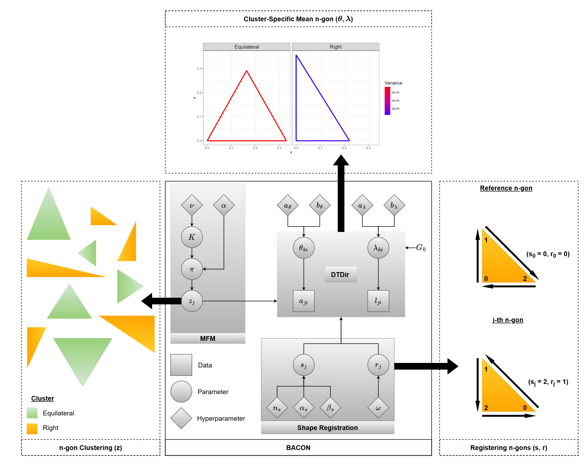

# BACON: Bayesian Clustering of *n*-gons

## Overview



## Mixture of Finite Mixtures

```r
bacon_mfm(NumericMatrix A, NumericMatrix L, double w_A, double w_L, bool doub_dirich, bool ddirch_A, bool ddirch_L, int Kmax_0, bool est_sr, bool est_s, bool est_r, double alpha_s, double beta_s, int iter)
```
